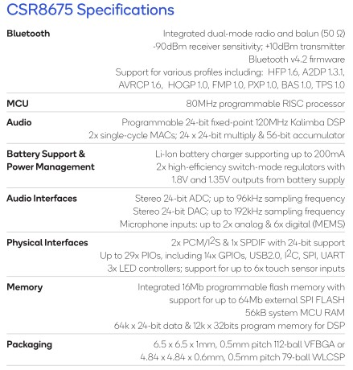

# [CSR8675](https://github.com/sochub/CSR8675)

 

#### 归属：[CSR](https://github.com/sochub/CSR)

## [描述](https://github.com/sochub/CSR8675/wiki) 

[CSR8675](https://www.qualcomm.com/products/csr8675)是目前qualcomm（高通）家最新的Bluetooth Audio SoC，也是市场上最为强大的蓝牙SoC之一

 

## [组成](SoC/) 

#### [开发文档](docs/)

包括蓝牙音频开发资料

#### [开发工具](https://github.com/sochub/CSR)

---

###  [SoC开发平台](http://www.qitas.cn)   
###  qitas@qitas.cn